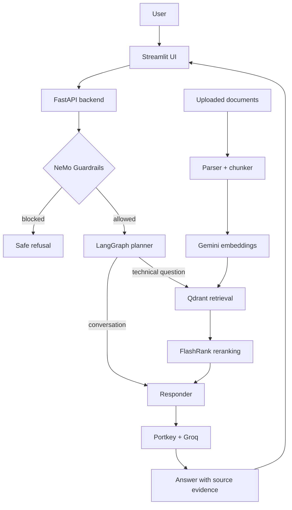

# Enterprise Agentic RAG - Beginner-to-Interview Guide

> **Goal:** Read this document from top to bottom before discussing the project in an interview. It explains what the application does, why each component exists, how the code is organized, and how to answer common questions honestly and clearly.

## 1. Start here: what did we build?

This project is an **AI assistant for private technical documents**. A user uploads or prepares documents such as PDFs, Word files, HTML pages, text files, or PowerPoint slides. The application reads those documents and lets the user ask questions in natural language.

Example:

```text
Document: Kubernetes job-management guide
Question: How do I monitor a Kubernetes Job?
Answer: A concise answer generated from the relevant parts of that guide,
        with the source filename and retrieved evidence shown to the user.
```

The important idea is that the assistant should not answer only from its general training. It first searches the provided documents and then answers using that evidence. This is called **Retrieval-Augmented Generation (RAG)**.

### One-sentence interview answer

> “Enterprise Agentic RAG is a FastAPI and Streamlit application that ingests technical documents, indexes them in Qdrant using Gemini embeddings, retrieves and reranks evidence for a question, applies safety guardrails, and returns an answer with source traceability.”

### The problem it solves

Normal document search returns links or matching keywords. A normal LLM can give fluent answers but may invent information. This project combines the two:

1. Search the organisation's trusted documents.
2. Select the best passages.
3. Give those passages to an LLM with clear instructions.
4. Show the supporting source to the user.

This is useful for internal IT knowledge bases, policy assistants, product-support documentation, engineering runbooks, and similar private-document use cases.

---

## 2. The most important words, in plain English

| Term | Simple meaning | Why it matters here |
|---|---|---|
| **LLM** | A Large Language Model such as a Groq-hosted model. It writes natural-language answers. | It turns retrieved evidence into a readable answer. |
| **RAG** | Retrieval-Augmented Generation. Search documents first, then generate an answer. | Reduces unsupported answers and lets the system use private data. |
| **Embedding** | A long list of numbers representing the meaning of text. | Lets the system search by meaning, not only exact words. |
| **Vector database** | A database optimized for searching embeddings. | Qdrant stores document chunks and finds similar chunks quickly. |
| **Chunk** | A small piece of a larger document. | The system searches manageable passages instead of an entire PDF. |
| **Reranking** | A second, more precise ordering of search results. | FlashRank moves the strongest evidence to the top. |
| **API** | A structured way for software systems to communicate. | Streamlit calls the FastAPI backend; the backend calls AI services. |
| **FastAPI** | A Python framework for building web APIs. | It exposes `/query`, `/documents`, and `/health`. |
| **Streamlit** | A Python framework for building data/AI web interfaces quickly. | It provides the visible chat and upload experience. |
| **LangChain** | A library that helps connect LLMs, prompts, retrievers, and tools. | It supplies integrations used by the system. |
| **LangGraph** | A library for modeling LLM workflows as a graph of steps and decisions. | It controls Planner -> Retriever -> Responder flow and conversation memory. |
| **Guardrails** | Rules and checks around an LLM. | They block jailbreaks and off-topic requests before retrieval. |
| **Observability** | Traces, logs, and metrics that show what the system did. | Logfire and LangSmith make failures and decisions visible. |

---

## 3. Python and web-development basics you need

You do not need to memorize every line of Python. You need to understand the role of the common building blocks.

### Python modules and imports

A Python file is a **module**. `import` lets one module use code from another module.

```python
from app.services.retrieval.qdrant_service import search_enterprise_knowledge
```

This means: “Use the `search_enterprise_knowledge` function defined in the Qdrant service file.” It keeps the application organized rather than putting all code in one large file.

### Functions

A function is a reusable unit of work.

```python
def health_check():
    return {"status": "ok"}
```

The function runs when a client requests the health endpoint. Functions make code easier to test and reason about.

### Classes and models

Classes group data and behavior. This project uses Pydantic models to validate API data.

```python
class QueryRequest(BaseModel):
    q: str
    thread_id: str
```

This means an incoming query should contain text (`q`) and a conversation ID (`thread_id`). Validation prevents malformed input from silently reaching the AI workflow.

### JSON

APIs commonly send **JSON**, a text format for structured data.

```json
{
  "q": "How do I monitor a Kubernetes Job?",
  "thread_id": "demo-session"
}
```

The backend returns JSON with the answer, status, reasoning steps, and sources.

### Environment variables

Environment variables are secret or deployment-specific values kept outside source code.

```text
GEMINI_API_KEY=...
QDRANT_API_KEY=...
```

Never hardcode these keys in Python files or commit them to GitHub. The project reads them through `os.getenv()` in `app/config.py`.

---

## 4. Why are there so many APIs and keys?

One product can use several specialized services. Each service does a different job better than a single general-purpose API could.

| Variable / service | What it is used for | Why it exists |
|---|---|---|
| `GEMINI_API_KEY` | Google Gemini embedding model | Converts document chunks and questions into vectors for semantic search. |
| `QDRANT_API_KEY` and `QDRANT_CLUSTER_ENDPOINT` | Qdrant Cloud | Stores vectors and performs fast similarity search. |
| `GROQ_API_KEY` | Groq model access | Runs the guardrail classifier and enables fast LLM inference. |
| `GROQ_FALLBACK_API_KEY` | Secondary Groq credential | Supports a fallback path when the primary route is unavailable. |
| `PORTKEY_API_KEY` | Portkey LLM gateway | Centralizes routing, retry/fallback behavior, cache signals, and request metadata. |
| `LOGFIRE_TOKEN` | Pydantic Logfire | Records logs and spans for debugging and observability. |
| `LANGSMITH_API_KEY` | LangSmith | Captures LangChain/LangGraph traces and helps inspect agent behavior. |
| `JUDGE_GROQ` | Evaluation-only model key | Scores RAG evaluation metrics without using the live app's key. |

### Why not use only one LLM API?

Because the tasks are different:

- Embeddings need a model optimized for semantic representation, not conversational text.
- A vector database needs optimized nearest-neighbor search.
- The answer model needs strong natural-language generation.
- An LLM gateway handles reliability and observability across model providers.
- Monitoring tools should be independent so developers can diagnose behavior.

### Correct security answer in an interview

> “The browser never receives the provider keys. The Streamlit UI talks to the backend, and the backend holds secrets as environment variables in Render. Keys are excluded from Git with `.env` in `.gitignore`.”

---

## 5. High-level architecture



### Read the architecture from left to right

1. The user asks a question in Streamlit.
2. Streamlit calls FastAPI's `/query` endpoint.
3. Guardrails inspect the question before document search or answer generation.
4. The planner decides whether the question needs documents.
5. Technical questions retrieve evidence from Qdrant and rerank it.
6. The responder creates an answer using the question, retrieved context, and conversation history.
7. The UI shows the answer and the supporting source chunks.

---

## 6. File-by-file map of the repository

| Location | Responsibility | Interview explanation |
|---|---|---|
| `app/main.py` | FastAPI entrypoint and endpoints | “This is the backend boundary. It validates requests and returns structured responses.” |
| `app/config.py` | Environment-variable configuration | “This keeps secrets and deployment configuration outside source code.” |
| `app/agents/graph.py` | LangGraph workflow | “This defines which agent node runs next.” |
| `app/agents/state.py` | Shared workflow state | “It describes data passed between planner, retriever, and responder.” |
| `app/agents/nodes/planner.py` | Intent classification and query refinement | “It decides conversational versus retrieval-based handling.” |
| `app/agents/nodes/retriever.py` | Search and reranking | “It turns a query into evidence records.” |
| `app/agents/nodes/responder.py` | Final answer generation | “It constructs a grounded prompt from context and history.” |
| `app/ingestion/loaders/` | PDF, HTML, TXT, DOCX, PPTX parsing | “Each format has a suitable local parser.” |
| `app/ingestion/chunking/splitter.py` | Splits text into chunks | “It keeps chunks within a bounded context size.” |
| `app/ingestion/processor.py` | Parse -> chunk -> embed -> index | “This is the ingestion pipeline.” |
| `app/services/retrieval/embedding.py` | Gemini embedding client | “Creates semantic vectors for text.” |
| `app/services/retrieval/qdrant_service.py` | Qdrant query service | “Finds semantically similar chunks.” |
| `app/services/retrieval/ranking_service.py` | FlashRank reranker | “Improves the ordering of initial search results.” |
| `app/services/retrieval/citations.py` | Context formatting and citation records | “Preserves source provenance into the final UI/API response.” |
| `app/guardrails/` | NeMo Guardrails rules | “Rejects unsafe or unrelated requests early.” |
| `app/gateway/client.py` | Portkey and model routing | “Encapsulates retries, fallback, metadata, and model access.” |
| `ui/app.py` | Streamlit application | “The browser-facing experience, upload flow, chat, and source display.” |
| `evals/` | Golden data, pipeline, and RAGAS metrics | “Measures quality instead of relying on subjective demos.” |
| `tests/` | Fast unit tests | “Tests pure behaviors such as citation formatting and chunk size.” |
| `Dockerfile` | Backend container definition | “Makes backend runtime repeatable in deployment.” |

---

## 7. Ingestion: from file to searchable knowledge

### Step 1: upload or provide a document

The UI supports PDF, HTML, TXT, DOCX, and PPTX. The backend validates:

- file extension;
- empty file content;
- a 25 MB size limit per uploaded file.

This validation protects the service from unsupported formats and unusually large uploads.

### Step 2: parse the file

Different formats need different parsers:

| Format | Parser approach |
|---|---|
| PDF | `pypdf` / local PDF extraction |
| HTML | BeautifulSoup parsing |
| TXT | Direct text reading |
| DOCX | `python-docx` or local loader |
| PPTX | `python-pptx` or local loader |

The result is plain text.

### Step 3: split text into chunks

Sending an entire document to an LLM is slow, expensive, and often impossible because models have context limits. The chunker divides the document into smaller passages, using paragraphs where possible.

The current chunker has a maximum-size boundary. This is important: a very long paragraph must not create an oversized chunk.

### Step 4: create embeddings

Each chunk becomes an embedding vector through Gemini. Similar meanings produce vectors that are close together in mathematical space.

Example idea:

```text
“How do I scale pods?”
“Horizontal Pod Autoscaler increases replica count.”
```

These sentences use different words but have related meaning, so vector search can connect them.

### Step 5: index in Qdrant

The project stores:

- the embedding vector;
- chunk text;
- original filename;
- source type, such as `true`, `noisy`, or `uploaded`.

The collection is named `enterprise_rag`. For first-time user uploads, the backend creates the collection automatically if it does not already exist.

### Strong interview answer

> “The ingestion pipeline is modular. A loader extracts text, the chunker makes bounded passages, Gemini generates embeddings, and Qdrant stores vectors with filename and source metadata. Keeping metadata is important because it lets the UI show the evidence behind an answer.”

---

## 8. Retrieval: how the system finds relevant information

When the user asks a technical question, the system does not scan every document one by one.

### Vector search in Qdrant

1. Convert the user question into an embedding.
2. Ask Qdrant for the most similar stored chunk vectors.
3. Receive candidate chunks with a similarity score, filename, and content.

The project initially retrieves more candidates than it ultimately uses. This is a common pattern: vector search is fast, but not perfect.

### Why reranking is needed

The vector database is good at broad semantic matching. However, the top result may be related but not the best answer to the exact question.

FlashRank is a **cross-encoder reranker**. It reads the question and candidate passage together and assigns a more precise relevance score.

```text
Question -> Qdrant retrieves 15 candidate chunks -> FlashRank keeps best 5 -> LLM answers
```

### Why retain citations

Earlier RAG implementations often turn results into anonymous strings and lose source information. This project preserves:

- `source` - original filename;
- `source_type` - trusted/uploaded/noisy category;
- `score` - retrieval similarity;
- `rerank_score` - second-stage relevance.

That makes the answer inspectable and is an important enterprise design choice.

### Important limitation to say honestly

Source attribution improves transparency, but it does not automatically prove every sentence is correct. A production system should additionally validate grounding, evaluate results, and potentially require human review for high-risk decisions.

---

## 9. LangChain and LangGraph

### What is LangChain?

LangChain is an integration library. It provides common interfaces for models, embedding providers, document tools, and retrievers. In this project, `ChatOpenAI` is used with Portkey's OpenAI-compatible endpoint, even though the actual model provider is Groq.

### What is LangGraph?

LangGraph is used when an LLM application has multiple steps and decisions. Instead of writing one giant prompt, we define nodes and transitions.

Current graph:

```text
Planner
  -> Conversational? -> Responder -> End
  -> Technical?      -> Retriever -> Responder -> End
```

### Why a graph instead of a simple function chain?

A simple chain always runs the same sequence. This project needs branching:

- a greeting does not need Qdrant search;
- a technical question does;
- future versions can add more nodes, such as clarification, tool use, or human approval.

### What is the state object?

`AgentState` is the shared data passed between nodes. It includes:

- `messages` - previous user/assistant messages;
- `current_query` - original or refined search query;
- `documents` - retrieved evidence records;
- `plan` - visible reasoning/status steps;
- `status` - current outcome;
- `final_answer` - response returned to the API.

### Conversation memory

LangGraph's `MemorySaver` uses `thread_id` to keep the conversation associated with a user session. If the same user asks a follow-up question, the planner and responder can see earlier messages.

### Strong interview answer

> “I used LangGraph because routing is conditional. The planner decides whether retrieval is necessary, then the retriever and responder run only for technical questions. The shared state and thread ID make conversation memory explicit rather than hidden in a global variable.”

---

## 10. Prompt engineering in this project

Prompt engineering is not only writing a clever sentence. It is designing instructions and context so the model has the right task, boundaries, and evidence.

### Planner prompt

The planner receives conversation history and the latest question. It is instructed to output either:

```text
CONVERSATIONAL
```

or a refined technical search query.

This makes routing simple and machine-readable.

### Responder prompt

For a technical question, the responder includes:

- attributed technical context;
- conversation history;
- the latest user question;
- a role instruction such as “Senior Technical Architect.”

The prompt tells the model to answer from supplied context rather than inventing unrelated details.

### Context budget

The responder limits evidence size to avoid exceeding model token limits. More context is not always better: too much irrelevant text can make answers less focused and more expensive.

### Interview question: “How do you reduce hallucinations?”

Good answer:

> “I reduce hallucinations by retrieving source documents first, reranking the best passages, including only bounded context in the generation prompt, showing citations, and measuring faithfulness with the evaluation suite. For higher-risk workflows I would add explicit ‘I do not know’ behavior and confidence thresholds.”

---

## 11. Guardrails and safety

### What guardrails do here

Before retrieval, NeMo Guardrails checks whether a request appears to be:

- off-topic;
- a jailbreak attempt;
- a greeting or capability question;
- a normal technical request.

If a rail fires, the application returns a predefined safe response and skips retrieval.

### Why put safety before retrieval?

It saves model and database work, reduces risk of unnecessary data exposure, and gives consistent behavior for known unsafe patterns.

### Important technical detail

The guardrail gate currently uses a Groq-hosted model directly. The main RAG generation path uses Portkey plus Groq routing. Therefore `GROQ_API_KEY` must be correctly configured even if Portkey is configured.

### Limitations

Pattern-based rail definitions are useful but not a complete security solution. A mature system should add rate limits, authentication, audit logs, input-size controls, red-team testing, and authorization-aware retrieval.

---

## 12. FastAPI endpoints

### `GET /health`

Returns:

```json
{"status":"ok","service":"enterprise-agentic-rag"}
```

Render uses this to confirm the container is running. It only confirms basic service health; it does not prove that every external provider key is valid.

### `POST /query`

Accepts a question and conversation ID.

```json
{
  "q": "How do I monitor a Kubernetes Job?",
  "thread_id": "candidate-demo"
}
```

Returns an answer, status, visible workflow steps, and evidence records.

### `POST /documents`

Accepts multipart file uploads. It validates supported extension and size, then sends the document through the ingestion pipeline. Successful uploads return the filename and number of indexed chunks.

### Why typed API models matter

Pydantic models make the API contract explicit. They help generate API documentation, reject malformed input, and make frontend/backend integration safer.

---

## 13. Streamlit user experience

The Streamlit UI is the part users see. Its responsibilities are:

- create a session ID for conversation memory;
- provide a chat experience;
- call the backend with HTTP requests;
- show status while the agent works;
- show retrieved source chunks and relevance;
- provide a document-upload workspace.

### Upload workflow

The upload dialog has client-side guidance and sends one file at a time to `/documents`. The backend is responsible for actual validation and indexing because clients cannot be trusted.

### Why source display matters

For a recruiter or business user, a source panel demonstrates that the application is not merely a generic chatbot. It shows the retrieved evidence and makes the system's behavior easier to review.

---

## 14. Evaluation: how do we know RAG is useful?

“It gave a good answer once” is not evaluation. This repository includes an `evals/` package with a golden dataset and several measurement approaches.

| Metric | Question it answers |
|---|---|
| Faithfulness | Is the answer supported by retrieved context? |
| Answer relevancy | Does the answer address the user's question? |
| Context precision | Are relevant chunks ranked near the top? |
| Context recall | Did retrieval find the necessary information? |
| Answer correctness | Does the answer match a human reference answer? |
| Tool correctness | Did the planner take the expected route? |
| Guardrail precision/recall | Did safety rules block unsafe inputs without blocking valid ones? |

### Golden dataset

A golden dataset is a fixed collection of known questions, expected answers, expected contexts, and expected tool behavior. It is used every time the system changes so developers can detect regressions.

### RAGAS

RAGAS is a framework for evaluating RAG systems. Some metrics use a separate judge LLM to assess quality. This is useful, but it also has cost and variability, so results should be tracked over time rather than treated as absolute truth.

### Strong interview answer

> “I separated demo behavior from evaluation. The golden dataset gives repeatable examples, RAGAS measures retrieval and generation quality, and guardrail tests measure safety behavior. That lets us identify whether a regression came from retrieval, reranking, prompting, or routing.”

---

## 15. Observability: Logfire and LangSmith

### Logfire

Logfire records application logs and nested spans. A span is a timed unit of work, for example:

```text
Planner decision
  -> Knowledge retrieval
     -> Semantic reranking
        -> LLM synthesis
```

This helps answer: “Where did the request fail?” and “Which stage was slow?”

### LangSmith

LangSmith traces LangChain and LangGraph activity. It is useful for seeing prompts, model calls, routing behavior, and evaluation data.

### Why use both?

They have overlapping but different strengths. Logfire gives application-level structured observability, while LangSmith is specialized for LLM-chain and graph inspection. In a simpler project, one tool may be enough; using both here demonstrates observability concepts but adds operational complexity.

---

## 16. Deployment

### Services used

| Service | Role |
|---|---|
| Render | Runs the FastAPI backend inside Docker. |
| Streamlit Community Cloud | Hosts the visible web UI. |
| Qdrant Cloud | Hosts vector database data. |
| Groq / Portkey / Gemini | Provide model and embedding services. |

### Why Docker?

Docker packages the backend code and dependencies into a repeatable container. Without it, “works on my machine” problems are common because each computer may have different Python or library versions.

### Health checks

Render calls `/health` to confirm the web process is alive. The backend must listen on `0.0.0.0` and use Render's assigned `PORT`; the Dockerfile supports this.

### Deployment debugging order

1. Confirm `GET /health` returns `status: ok`.
2. Confirm all environment variables are configured in Render.
3. Test a technical query and inspect Render logs.
4. Test document upload.
5. Confirm Streamlit's `BACKEND_URL` is the Render URL without a trailing slash.
6. Check Logfire/LangSmith for the failing stage.

---

## 17. Design decisions and trade-offs

| Decision | Why it was chosen | Trade-off |
|---|---|---|
| Qdrant instead of keyword-only search | Semantic search handles paraphrases. | Requires embedding API and vector database operations. |
| Reranking after vector search | Improves result quality. | Adds latency and model download/runtime cost. |
| LangGraph routing | Supports conditional workflows and memory. | More components to understand than one prompt. |
| NeMo Guardrails before retrieval | Blocks known unsafe/off-topic inputs early. | May over-block valid questions if rails are too strict. |
| Portkey gateway | Centralizes fallback/retry/metadata. | Adds another provider and configuration step. |
| Source citations | Builds trust and supports debugging. | Citations are evidence signals, not a mathematical proof of truth. |
| Separate UI and API | Cleaner separation of concerns and deployment. | Requires correct URL, CORS/networking, and two deployments. |
| Upload API | Lets users add knowledge dynamically. | Needs validation, size limits, authentication, and storage policy. |

---

## 18. Current limitations and thoughtful improvements

Good candidates do not claim a project is perfect. Explain what you would improve.

1. **Authentication and access control** - add users, roles, and document-level permissions.
2. **Persistent upload metadata** - store user uploads and indexing jobs in durable storage instead of relying only on process-local state.
3. **Async ingestion jobs** - use a queue for large files so the HTTP request does not wait for parsing/embedding.
4. **Better error reporting** - expose safe, actionable errors to users while keeping technical details in logs.
5. **Rate limits and quotas** - prevent expensive provider misuse.
6. **Citation quality checks** - evaluate whether every key answer claim has supporting evidence.
7. **Model configuration** - move model IDs and provider slugs to environment variables; update deprecated models before provider shutdown dates.
8. **Production tests** - add API integration tests with mocked Gemini, Qdrant, Groq, and Portkey clients.
9. **Data governance** - define document retention, deletion, PII handling, and tenant isolation.
10. **Monitoring dashboards** - track latency, retrieval quality, guardrail blocks, token cost, and failed uploads.

### Excellent answer to “What would you do next?”

> “I would make ingestion asynchronous and authenticated, add document-level access control, and build integration tests with provider mocks. Then I would use the golden dataset and production telemetry to tune chunk size, retrieval limits, and reranking thresholds based on measured quality and latency.”

---

## 19. Interview questions and answer patterns

### Q1. What is RAG?

> “RAG stands for Retrieval-Augmented Generation. Instead of asking an LLM to answer only from pretraining, the application retrieves relevant document passages and places them in the prompt. This makes answers more specific to private data and allows source attribution.”

### Q2. Why use embeddings?

> “Embeddings represent meaning numerically. They allow a search for ‘how do I scale pods?’ to find passages about the Horizontal Pod Autoscaler even if exact keywords differ.”

### Q3. Why Qdrant?

> “Qdrant is a vector database designed for efficient similarity search and metadata payloads. We store chunk content, source filename, source type, and vectors together so search results remain traceable.”

### Q4. Why use reranking if Qdrant already ranks results?

> “Vector search is fast and broad. Reranking is a slower but more precise second stage that compares the question and candidate passage directly. We retrieve a larger candidate set, then keep the most relevant evidence.”

### Q5. What is the difference between LangChain and LangGraph?

> “LangChain supplies model and integration abstractions. LangGraph models the conditional workflow between steps. I use LangGraph because the application can route conversational questions directly to a responder and technical questions through retrieval.”

### Q6. How does memory work?

> “The API receives a `thread_id`. LangGraph's checkpointer associates state with that ID, allowing later messages in the same conversation to use previous messages as history.”

### Q7. How do you prevent hallucinations?

> “I do not claim to eliminate them completely. I reduce risk through retrieval, reranking, bounded evidence context, citation display, guardrails, and metrics such as faithfulness. For high-risk workflows I would add confidence thresholds and human review.”

### Q8. Why do you need guardrails before retrieval?

> “It blocks unsafe or irrelevant requests before database and LLM work occurs. That reduces unnecessary cost and makes behavior more predictable.”

### Q9. What happens when a user uploads a document?

> “The API checks size and extension, temporarily stores the file, parses text, splits it into chunks, creates embeddings, stores the chunks in Qdrant, and returns the number of indexed chunks. The original temporary upload file is deleted after processing.”

### Q10. Why is there both a Streamlit application and FastAPI?

> “Streamlit is optimized for quickly building the interactive user experience. FastAPI provides a structured backend contract that can later serve other clients, such as React, mobile, or internal services. This separation keeps UI and business logic independent.”

### Q11. What does Portkey do?

> “Portkey is an LLM gateway. In this project it centralizes model routing, retry behavior, fallback targets, cache status, and request metadata while exposing an OpenAI-compatible interface to the application.”

### Q12. Why are API keys environment variables?

> “Keys are secrets and change across environments. Environment variables keep them out of source code and allow Render, local development, and CI to have separate configurations.”

### Q13. What is a health endpoint?

> “It is a lightweight endpoint used by infrastructure to check that the web service is running. It is different from a complete readiness test because it does not necessarily verify every external dependency.”

### Q14. How do you test RAG quality?

> “I use a golden dataset with known questions and expected behavior, then measure faithfulness, relevancy, context precision, context recall, correctness, routing/tool correctness, and guardrail outcomes.”

### Q15. What is the most difficult production concern?

> “Data governance. Enterprise RAG must control who can upload, access, retrieve, and retain documents. Model quality matters, but access control, auditability, and safe failure behavior are equally important.”

### Q16. Why did an upload fail even though `/health` worked?

> “The health endpoint confirms that the web process is alive. Upload requires additional dependencies: file parsing, Gemini embeddings, Qdrant connectivity, and a valid collection. I debug this by checking the specific endpoint logs and provider configuration.”

---

## 20. A five-minute project walkthrough for an interview

Use this order when presenting:

1. **Problem (30 seconds):** “Teams have large technical document sets and need answers they can verify.”
2. **Architecture (45 seconds):** show the README diagram and explain UI -> API -> guardrail -> planner -> retrieval -> reranking -> answer.
3. **Live UI (60 seconds):** upload a small document and ask a technical question.
4. **Evidence (45 seconds):** open the source panel and explain filename, source type, and relevance scores.
5. **Code (60 seconds):** show `app/main.py`, `processor.py`, `graph.py`, and `citations.py`.
6. **Quality (45 seconds):** show `tests/`, GitHub Actions, and the `evals/` folder.
7. **Trade-offs (45 seconds):** explain limitations and planned improvements.

Do not say “I know every library internally.” Say:

> “I understand the architecture, data flow, API boundaries, and design trade-offs. When I use a framework, I read its documentation, test the integration, and use observability to validate actual behavior.”

---

## 21. 14-day learning plan

### Days 1-2: foundation

- Read Sections 1-5 of this guide.
- Learn Python functions, dictionaries, lists, imports, exceptions, and environment variables.
- Run `GET /health` and understand its JSON response.

### Days 3-4: ingestion and retrieval

- Read Sections 7-8.
- Open `app/ingestion/processor.py` and follow the function step by step.
- Explain chunking, embeddings, Qdrant, and reranking without notes.

### Days 5-6: agent workflow

- Read Sections 9-11.
- Draw Planner -> Retriever -> Responder on paper.
- Practice explaining why a greeting should skip retrieval.

### Days 7-8: API and UI

- Read Sections 12-13.
- Open `app/main.py` and `ui/app.py`.
- Explain the difference between frontend and backend.

### Days 9-10: quality and deployment

- Read Sections 14-16.
- Run unit tests.
- Explain a health check, Docker, environment variables, and deployment logs.

### Days 11-12: trade-offs

- Read Sections 17-18.
- Write down three limitations and three improvements in your own words.

### Days 13-14: mock interview

- Answer the questions in Section 19 aloud.
- Give the five-minute walkthrough twice.
- When you cannot explain something, revisit the relevant file and section.

---

## 22. Final honesty checklist

Before an interview, make sure you can clearly distinguish:

- what the current implementation does;
- what you personally changed, configured, tested, or deployed;
- what is a planned improvement;
- what you do not know yet but are ready to learn.

The strongest interview performance comes from clear reasoning, honest trade-offs, and the ability to explain the system from a user question all the way to the final evidence-backed response.
