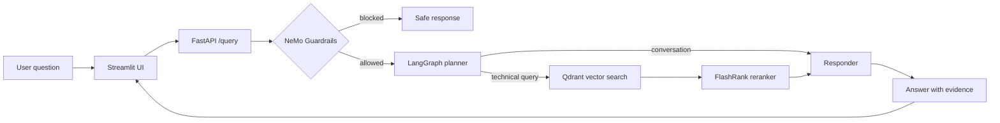

# Enterprise Agentic RAG

An evidence-first AI assistant for technical document intelligence. It ingests mixed enterprise documents, retrieves and reranks the most relevant evidence, applies safety guardrails, and delivers source-attributed answers through a FastAPI service and Streamlit interface.

> **Live demo:** [Open Enterprise Agentic RAG](https://anil-enterprise-rag.streamlit.app/)

Use the demo to upload a supported document, ask a technical question, and inspect the retrieved evidence that supports the answer.

## Why this project

Enterprise teams need answers they can verify, not a generic chatbot. This project demonstrates an end-to-end RAG application with:

- document ingestion for PDF, HTML, TXT, DOCX, and PPTX files;
- semantic search with Gemini embeddings and Qdrant;
- local cross-encoder reranking with FlashRank;
- agentic routing for conversational versus knowledge-seeking questions;
- NeMo guardrails for off-topic, jailbreak, and prompt-injection attempts;
- source-aware answers, automated tests, CI, evaluation workflows, and container readiness.

## At a glance

| Area | Implementation |
|---|---|
| API | FastAPI with typed `/query` and `/health` endpoints |
| Agent orchestration | LangGraph planner, retriever, and responder nodes with thread memory |
| Retrieval | Gemini embeddings, Qdrant Cloud, and FlashRank reranking |
| LLM access | Portkey gateway with Groq primary/fallback routing |
| Safety | NVIDIA NeMo Guardrails before retrieval and generation |
| User experience | Streamlit chat interface with retrieved-source visibility |
| Quality | Golden-dataset evaluation suite, unit tests, and GitHub Actions CI |
| Delivery | Dockerfile and deployment/demo runbook |

## How it works



For technical questions, the retriever preserves each chunk's filename, source type, retrieval score, and reranking score. The UI exposes this evidence alongside the answer, making the RAG behavior easier to inspect and trust.

## Engineering highlights

### Evidence-first retrieval

The pipeline keeps document metadata through retrieval and reranking instead of returning anonymous text chunks. This makes answers traceable to their source documents and gives users a practical way to validate generated output.

### Safety before generation

NeMo Guardrails runs before the RAG workflow. Blocked inputs skip retrieval and generation, reducing exposure to prompt injection, jailbreak attempts, and unrelated requests.

### Evaluation and quality gates

The `evals/` package includes a golden dataset, guardrail test cases, RAGAS-based scoring, and a Streamlit evaluation dashboard. Focused unit tests cover source attribution and chunking behavior; GitHub Actions runs them on pushes and pull requests.

## Repository map

```text
app/
  agents/        LangGraph planner, retriever, responder, and state
  ingestion/     Document parsing, chunking, and vector indexing
  services/      Embeddings, Qdrant retrieval, reranking, citations
  guardrails/    NeMo safety policies
  gateway/       Portkey-backed LLM client
  main.py        FastAPI application
ui/              Streamlit chat experience
evals/           Golden dataset, evaluation pipeline, and metrics dashboard
tests/           Fast unit tests for core retrieval utilities
DATA/            Sample true-data and noisy-data corpora
DOCS/            Architecture, operations, evaluation, and deployment guides
```

## Run locally

### 1. Install dependencies

```bash
python -m venv .venv
source .venv/bin/activate  # Windows: .venv\\Scripts\\activate
pip install -r requirements.txt
```

### 2. Configure services

Copy `.env.example` to `.env` and provide the required credentials:

```env
GEMINI_API_KEY=
QDRANT_API_KEY=
QDRANT_CLUSTER_ENDPOINT=
GROQ_API_KEY=
GROQ_FALLBACK_API_KEY=
PORTKEY_API_KEY=
LOGFIRE_TOKEN=
LANGSMITH_API_KEY=
```

Never commit `.env` or API keys.

### 3. Ingest the sample corpus

```bash
python -m app.ingestion.processor DATA --wipe
```

### 4. Start the API and UI

```bash
# Terminal 1
uvicorn app.main:app --reload --port 8000

# Terminal 2
streamlit run ui/app.py
```

Confirm the API is ready:

```bash
curl http://localhost:8000/health
```

## Quality checks

```bash
pip install -r requirements-dev.txt
pytest tests -q
```

For retrieval quality and guardrail behavior, run the evaluation interface after starting the API:

```bash
streamlit run evals/app.py
```

## Deployment

The public Streamlit experience is available at [anil-enterprise-rag.streamlit.app](https://anil-enterprise-rag.streamlit.app/). The FastAPI service is containerized with the provided `Dockerfile` and exposes a `/health` endpoint for deployment checks. See [Deployment and Demo Guide](DOCS/12_DEPLOYMENT_AND_DEMO.md) for the local demo flow, container commands, and a deployment checklist.

## Documentation

- [System architecture](ARCHITECTURE.md)
- [Ingestion engine](DOCS/02_INGESTION_ENGINE.md)
- [Agent decision flow](DOCS/03_NODE_INTELLIGENCE.md)
- [Guardrails](DOCS/08_GUARDRAILS.md)
- [LLM gateway](DOCS/09_LLM_GATEWAY.md)
- [Evaluation methodology](DOCS/10_EVALS.md)
- [Deployment and interview demo](DOCS/12_DEPLOYMENT_AND_DEMO.md)

## Project provenance

This repository is a structured portfolio import of the original [8hr-MARATHON](https://github.com/d-hackmt/8hr-MARATHON) project. The portfolio branch and commit layout group the implementation by engineering capability; see [SOURCE.md](SOURCE.md) for attribution.
